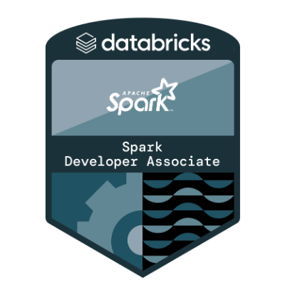

## Hi there 👋

Hi, I'm Roberto! An engineer with 7 years' experience in systems development, MBA in data engineering and a master's degree in artificial intelligence/computer engineering with a focus on Big Data!

## Certifications
 
&nbsp; &nbsp; 
&nbsp; &nbsp; 
&nbsp; &nbsp;
&nbsp; &nbsp; 
&nbsp; &nbsp; 
&nbsp; &nbsp; 

&nbsp; &nbsp; 
&nbsp; &nbsp; 
&nbsp; &nbsp;
&nbsp; &nbsp;
&nbsp; &nbsp;
&nbsp; &nbsp;

### 📫 How to reach me:
- [LinkedIn](https://www.linkedin.com/in/roberto-sa/)

## Languages

## Backend Frameworks

## Tools

